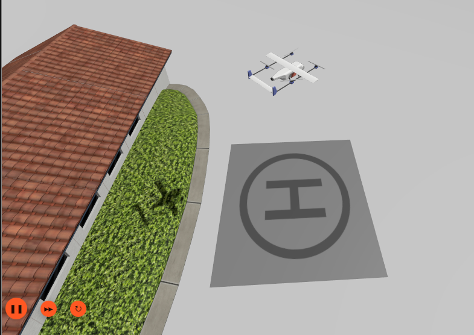

# MedVTOL: Simulation of an inter-hospital medical delivery UAV



A simulated VTOL UAV that delivers medical items between hospitals. It carries things like blood samples, vaccines, and medicines from one hospital helipad to another through air. The UAV takes off, flies on its own, and lands at the target hospital's helipad.

Built using Gazebo Harmonic and PX4 Autopilot, connected through ROS 2. It has a custom comapnon control software and a simple web dashboard to control missions.

## System Architecture

- **Environment:** ROS 2 Jazzy & Gazebo Harmonic
- **Flight Controller:** PX4 Autopilot (Offboard Mode)
- **Companion Computer:**
  - `mission_manager`: Runs the flight sequence (TAKEOFF → CLIMB → YAW_ALIGN → CRUISE → DESCEND → ALIGN → LAND)
  - `companion`: Sends flight paths from ROS 2 to PX4
  - `control_panel_ws`: Sends live UAV data over WebSockets
  - `control_panel_static`: Runs the control panel and handles requests
- **Coordinates:** You enter Gazebo (ENU) coordinates on the dashboard. The web server converts these to GPS (WGS84) for the UAV, which converts them again to local NED meters.

## Prerequisites

1. Install this Python package:

```bash
pip install websockets
```

2. Install Micro-XRCE-DDS using snap
```bash
sudo snap install micro-xrce-dds-agent --edge 
```

3. Clone the PX4 Autopilot git repository and place it at home folder.

## Quick Start Guide

### 1. Launch the Simulation

Run this from the workspace root to start Gazebo, PX4 SITL and all the control softwares:

```bash
./start_sim.sh
```

Optional — view the UAV's 3D model:

```bash
./view_urdf.sh
```


### 3. Command the UAV

Open your browser and go to: `http://localhost:8890`

Then:

1. Check that the telemetry stream shows **Connected**.
2. Enter the target **X, Y, Z** coordinates of the helipad.
3. Set your cruising altitude.
4. Click **Send Mission**. The UAV handles the rest.